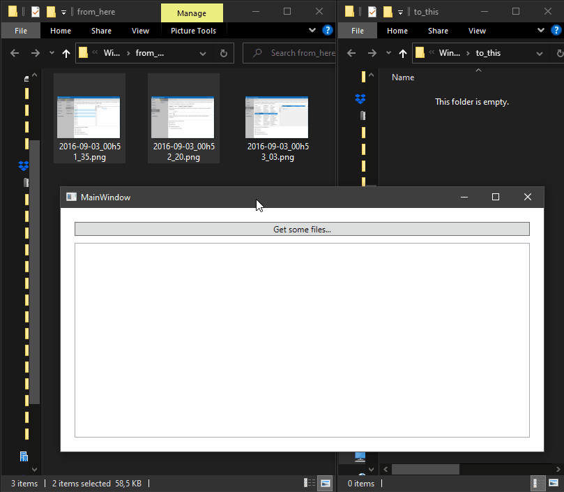

<!--
GENERATED FILE - DO NOT EDIT
This file was generated by [MarkdownSnippets](https://github.com/SimonCropp/MarkdownSnippets).
Source File: /README.source.md
To change this file edit the source file and then run MarkdownSnippets.
-->

# File drag&drop

Simple File drop sample with gong-wpf-dragdrop.

```xaml
<ListBox Grid.Row="1"
         dd:DragDrop.IsDragSource="True"
         dd:DragDrop.IsDropTarget="True"
         dd:DragDrop.DragHandler="{Binding}"
         dd:DragDrop.DropHandler="{Binding}"
         dd:DragDrop.UseDefaultDragAdorner="True"
         ItemsSource="{Binding Files}">

    <ListBox.ItemTemplate>
        <DataTemplate DataType="{x:Type models:FileModel}">
            <StackPanel Orientation="Vertical" Margin="5">
                <TextBlock Text="{Binding FileName}" FontSize="18" FontWeight="Bold" />
                <TextBlock Text="{Binding File}" FontSize="12" />
            </StackPanel>
        </DataTemplate>
    </ListBox.ItemTemplate>

</ListBox>
```

## Drop files

<!-- snippet: DropFiles -->
<a id='snippet-dropfiles'></a>
```cs
public void DragOver(IDropInfo dropInfo)
{
    if (dropInfo.DragInfo?.VisualSource is null
        && dropInfo.Data is DataObject dataObject
        && dataObject.GetDataPresent(DataFormats.FileDrop)
        && dataObject.ContainsFileDropList())
    {
        // Note that you can have more than one file.
        dropInfo.Effects = dataObject.GetData(DataFormats.FileDrop) is string[] files
                           && files.Any(File.Exists)
            ? DragDropEffects.Copy
            : DragDropEffects.None;
    }
    else
    {
        GongSolutions.Wpf.DragDrop.DragDrop.DefaultDropHandler.DragOver(dropInfo);
    }
}

public void Drop(IDropInfo dropInfo)
{
    if (dropInfo.DragInfo?.VisualSource is null
        && dropInfo.Data is DataObject dataObject
        && dataObject.GetDataPresent(DataFormats.FileDrop)
        && dataObject.ContainsFileDropList())
    {
        // Note that you can have more than one file.
        var files = dataObject.GetFileDropList();
        foreach (var file in files)
        {
            this.Files.Add(new FileModel(file));
        }
    }
    else
    {
        GongSolutions.Wpf.DragDrop.DragDrop.DefaultDropHandler.Drop(dropInfo);
    }
}
```
<sup><a href='/src/ViewModels/MainViewModel.cs#L97-L138' title='Snippet source file'>snippet source</a> | <a href='#snippet-dropfiles' title='Start of snippet'>anchor</a></sup>
<!-- endSnippet -->

## Drag files

<!-- snippet: DragFiles -->
<a id='snippet-dragfiles'></a>
```cs
public void StartDrag(IDragInfo dragInfo)
{
    // drag&drop inside the ListBox with control key
    if (Keyboard.Modifiers.HasFlag(ModifierKeys.Control))
    {
        GongSolutions.Wpf.DragDrop.DragDrop.DefaultDragHandler.StartDrag(dragInfo);
    }
    else
    {
        var files = dragInfo.SourceItems.OfType<FileModel>().Select(f => f.File).ToArray();

        var dataObject = new DataObject();
        var sc = new System.Collections.Specialized.StringCollection();
        sc.AddRange(files!);
        dataObject.SetFileDropList(sc);

        dragInfo.DataObject = dataObject;
        dragInfo.Effects = DragDropEffects.Copy;
    }
}

public bool CanStartDrag(IDragInfo dragInfo)
{
    return true;
}
```
<sup><a href='/src/ViewModels/MainViewModel.cs#L50-L78' title='Snippet source file'>snippet source</a> | <a href='#snippet-dragfiles' title='Start of snippet'>anchor</a></sup>
<!-- endSnippet -->

## In action



## Credits

README generated with [MarkdownSnippets](https://github.com/SimonCropp/MarkdownSnippets) by [@SimonCropp](https://github.com/SimonCropp)
